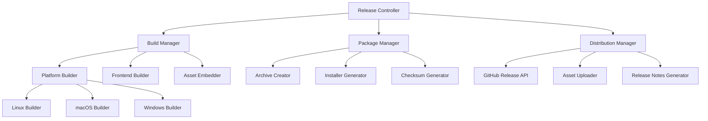

# Automated Release System Design

## Overview

The automated release system for MantisDB provides a comprehensive solution for building, packaging, and distributing cross-platform binaries. The system enhances the existing build scripts with improved error handling, better organization, and enhanced automation capabilities while maintaining backward compatibility.

## Architecture

### System Components



### Build Pipeline Flow

1. **Preparation Phase**: Environment validation, dependency checks, cleanup
2. **Frontend Build Phase**: React dashboard compilation and asset embedding
3. **Binary Build Phase**: Cross-platform Go binary compilation
4. **Packaging Phase**: Archive creation, installer generation, checksum calculation
5. **Distribution Phase**: GitHub release creation and asset upload

## Components and Interfaces

### 1. Release Controller (`scripts/release-controller.sh`)

**Purpose**: Main orchestrator that coordinates the entire release process

**Interface**:
```bash
./scripts/release-controller.sh [OPTIONS]
  --version VERSION          # Release version (default: auto-detect from git)
  --platforms PLATFORMS      # Comma-separated list of target platforms
  --mode MODE               # release|prerelease|draft (default: release)
  --config CONFIG_FILE      # Custom configuration file
  --dry-run                 # Simulate release without uploading
  --skip-frontend           # Skip frontend build (use existing)
  --skip-tests              # Skip test execution
  --parallel                # Enable parallel builds
```

**Key Functions**:
- Environment validation and setup
- Configuration parsing and validation
- Phase orchestration and error handling
- Progress reporting and logging

### 2. Enhanced Build Manager (`scripts/build-manager.sh`)

**Purpose**: Manages the compilation process for all platforms and components

**Interface**:
```bash
./scripts/build-manager.sh [OPTIONS]
  --platforms PLATFORMS     # Target platforms to build
  --version VERSION         # Version to embed in binaries
  --output-dir DIR          # Build output directory
  --cgo-enabled BOOL        # Enable/disable CGO builds
  --optimization LEVEL      # Build optimization level (size|speed|debug)
  --parallel                # Parallel compilation
```

**Key Functions**:
- Frontend compilation with asset embedding
- Cross-platform Go binary compilation
- Build optimization and flag management
- Dependency resolution and validation

### 3. Package Manager (`scripts/package-manager.sh`)

**Purpose**: Creates distribution packages with installers and documentation

**Interface**:
```bash
./scripts/package-manager.sh [OPTIONS]
  --input-dir DIR           # Directory containing built binaries
  --output-dir DIR          # Package output directory
  --include-docs            # Include documentation files
  --installer-type TYPE     # systemd|homebrew|chocolatey|all
  --compression LEVEL       # Compression level for archives
```

**Key Functions**:
- Platform-specific package creation
- Installer script generation
- Archive compression and organization
- Metadata file generation

### 4. Distribution Manager (`scripts/distribution-manager.sh`)

**Purpose**: Handles GitHub release creation and asset distribution

**Interface**:
```bash
./scripts/distribution-manager.sh [OPTIONS]
  --version VERSION         # Release version
  --assets-dir DIR          # Directory containing release assets
  --release-notes FILE      # Custom release notes file
  --mode MODE              # release|prerelease|draft
  --repo REPO              # GitHub repository (owner/name)
```

**Key Functions**:
- GitHub release creation via API
- Asset upload and verification
- Release notes generation
- Webhook notifications

## Data Models

### Build Configuration

```yaml
# build.config.yaml
version: "1.0.0"
build:
  platforms:
    - "linux/amd64"
    - "linux/arm64" 
    - "darwin/amd64"
    - "darwin/arm64"
    - "windows/amd64"
  
  optimization:
    level: "size"  # size|speed|debug
    cgo_enabled: false
    build_flags:
      - "-s"
      - "-w"
      - "-trimpath"
  
  frontend:
    build_command: "npm run build"
    output_dir: "admin/frontend/dist"
    embed_path: "admin/api/assets"

packaging:
  compression:
    level: 9
    format: "auto"  # tar.gz for unix, zip for windows
  
  installers:
    unix:
      systemd: true
      homebrew: true
    windows:
      chocolatey: true
      msi: false

distribution:
  github:
    repo: "mantisdb/mantisdb"
    draft: false
    prerelease: false
  
  notifications:
    webhook_url: "${RELEASE_WEBHOOK_URL}"
    slack_channel: "#releases"
```

### Release Metadata

```json
{
  "version": "1.0.0",
  "build_time": "2024-01-15T10:30:00Z",
  "git_commit": "abc123def",
  "platforms": [
    {
      "os": "linux",
      "arch": "amd64", 
      "binary": "mantisdb-linux-amd64",
      "package": "mantisdb-linux-amd64.tar.gz",
      "checksum": "sha256:...",
      "size": 12345678
    }
  ],
  "assets": {
    "binaries": 5,
    "packages": 5,
    "documentation": 3,
    "checksums": 1
  }
}
```

## Error Handling

### Build Error Recovery

1. **Platform Build Failures**: Continue building other platforms, report failures at end
2. **Frontend Build Failures**: Fail fast with clear error message and troubleshooting steps
3. **Dependency Issues**: Provide installation instructions and retry mechanisms
4. **Disk Space Issues**: Clean temporary files and provide space requirements

### Distribution Error Handling

1. **GitHub API Failures**: Implement retry logic with exponential backoff
2. **Asset Upload Failures**: Resume partial uploads, verify checksums
3. **Authentication Issues**: Clear error messages with setup instructions
4. **Network Timeouts**: Configurable timeout values and retry attempts

### Error Reporting Format

```json
{
  "phase": "build|package|distribute",
  "component": "frontend|binary|installer|github",
  "error_code": "BUILD_001",
  "message": "Human readable error message",
  "details": "Technical details and stack trace",
  "suggestions": [
    "Try running: npm install",
    "Check disk space: df -h"
  ],
  "timestamp": "2024-01-15T10:30:00Z"
}
```

## Testing Strategy

### Unit Testing

1. **Configuration Parsing**: Test YAML/JSON configuration validation
2. **Platform Detection**: Test OS/architecture detection logic
3. **Version Handling**: Test semantic version parsing and validation
4. **Checksum Generation**: Test SHA256 calculation accuracy

### Integration Testing

1. **Build Pipeline**: Test complete build process with mock artifacts
2. **Package Creation**: Verify archive contents and installer functionality
3. **GitHub API**: Test release creation with test repositories
4. **Cross-Platform**: Test builds on different host platforms

### End-to-End Testing

1. **Release Simulation**: Complete release process with dry-run mode
2. **Installation Testing**: Test installers on clean systems
3. **Binary Verification**: Test built binaries on target platforms
4. **Rollback Testing**: Test cleanup and rollback procedures

### Performance Testing

1. **Build Times**: Measure compilation times for different configurations
2. **Parallel Builds**: Test concurrent compilation efficiency
3. **Upload Performance**: Test asset upload speeds and reliability
4. **Resource Usage**: Monitor CPU, memory, and disk usage during builds

## Security Considerations

### Code Signing

```bash
# macOS code signing
codesign --sign "Developer ID Application: MantisDB" \
         --options runtime \
         --entitlements entitlements.plist \
         mantisdb-darwin-amd64

# Windows code signing (via signtool)
signtool sign /f certificate.p12 /p password /t http://timestamp.digicert.com mantisdb-windows-amd64.exe
```

### Secure Credential Management

1. **GitHub Tokens**: Use environment variables, never commit to repository
2. **Signing Certificates**: Store in secure key management systems
3. **API Keys**: Rotate regularly, use least-privilege access
4. **Build Secrets**: Encrypt sensitive build-time configuration

### Supply Chain Security

1. **Dependency Verification**: Pin frontend and Go module versions
2. **Build Reproducibility**: Ensure consistent builds across environments
3. **Artifact Integrity**: Verify checksums at every stage
4. **Audit Trail**: Log all build and release activities

## Monitoring and Observability

### Build Metrics

```yaml
metrics:
  build_duration_seconds:
    type: histogram
    labels: [platform, optimization_level]
  
  build_success_rate:
    type: counter
    labels: [platform, phase]
  
  artifact_size_bytes:
    type: gauge
    labels: [platform, compression_type]
  
  release_frequency:
    type: counter
    labels: [version_type, mode]
```

### Logging Strategy

```json
{
  "timestamp": "2024-01-15T10:30:00Z",
  "level": "INFO",
  "component": "build-manager",
  "phase": "binary-build",
  "platform": "linux/amd64",
  "message": "Starting binary compilation",
  "metadata": {
    "version": "1.0.0",
    "cgo_enabled": false,
    "build_flags": ["-s", "-w"]
  }
}
```

### Health Checks

1. **Environment Validation**: Check required tools and dependencies
2. **Resource Availability**: Verify disk space, memory, and CPU
3. **Network Connectivity**: Test GitHub API and CDN access
4. **Credential Validity**: Verify authentication tokens and certificates

## Migration and Compatibility

### Backward Compatibility

1. **Existing Scripts**: Maintain compatibility with current `build-production.sh` and `release.sh`
2. **Configuration**: Support both old environment variables and new config files
3. **Output Format**: Preserve existing artifact naming and structure
4. **API Compatibility**: Maintain existing command-line interfaces

### Migration Path

1. **Phase 1**: Enhance existing scripts with new features while maintaining interfaces
2. **Phase 2**: Introduce new configuration system with fallback to old methods
3. **Phase 3**: Add advanced features (parallel builds, enhanced error handling)
4. **Phase 4**: Deprecate old interfaces with clear migration documentation

### Version Management

```bash
# Support both old and new invocation methods
./scripts/build-production.sh  # Legacy method
./scripts/release-controller.sh --mode=legacy  # New system with legacy compatibility
```