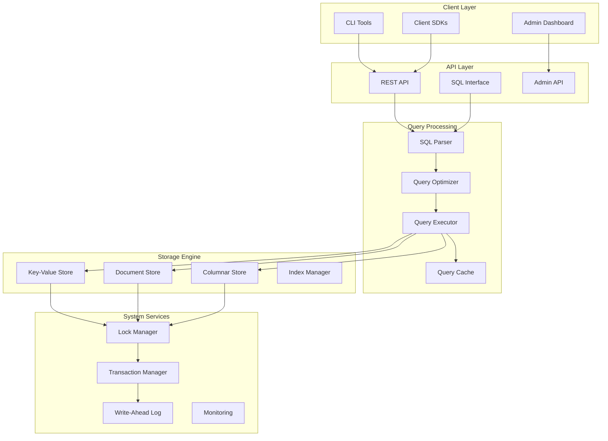
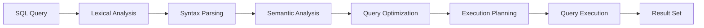

# Design Document

## Overview

This design outlines a comprehensive optimization and enhancement of MantisDB to address code organization, build system improvements, cross-platform installers, concurrency optimizations, SQL support integration, and advanced caching mechanisms. The solution will transform MantisDB into a production-ready database system with enterprise-grade features while maintaining backward compatibility.

## Architecture

### High-Level Architecture



### Modular Design Structure

The new architecture will be organized into clear, well-defined modules:

```
mantisdb/
├── cmd/                    # Command-line applications
├── pkg/                    # Core packages
│   ├── api/               # REST and Admin APIs
│   ├── sql/               # SQL processing engine
│   ├── storage/           # Storage engines
│   ├── cache/             # Caching system
│   ├── concurrency/       # Locking and transactions
│   ├── monitoring/        # Observability
│   └── config/            # Configuration management
├── internal/              # Internal packages
├── build/                 # Build system and tools
├── deployments/           # Deployment configurations
├── docs/                  # Consolidated documentation
└── scripts/               # Build and utility scripts
```

## Components and Interfaces

### 1. Code Organization and Documentation System

#### Consolidated Documentation Structure
- **Single Source of Truth**: All documentation will be consolidated into a hierarchical structure under `/docs`
- **Cross-Reference System**: Automated linking between related documentation sections
- **API Documentation**: Auto-generated from code comments using Go doc standards
- **User Guides**: Comprehensive guides for installation, configuration, and usage

#### Code Cleanup Strategy
- **Duplicate Code Elimination**: Extract common functionality into shared packages
- **Interface Standardization**: Define clear interfaces for all major components
- **Package Restructuring**: Reorganize code following Go best practices
- **Dependency Management**: Clean up and optimize module dependencies

### 2. Enhanced Build System and Cross-Platform Installers

#### Unified Build System
```yaml
# build.config.yaml
targets:
  - os: linux
    arch: [amd64, arm64]
    formats: [binary, deb, rpm, tar.gz]
  - os: darwin
    arch: [amd64, arm64]
    formats: [binary, pkg, tar.gz]
  - os: windows
    arch: [amd64]
    formats: [binary, msi, zip]

features:
  cgo_enabled: true
  static_linking: true
  compression: upx
  signing: true
```

#### Professional Installer Components
- **Linux**: `.deb` and `.rpm` packages with systemd service files
- **macOS**: `.pkg` installer with proper code signing and Homebrew formula
- **Windows**: MSI installer with Windows service integration
- **Docker**: Multi-stage builds with optimized images
- **Kubernetes**: Helm charts and operators

### 3. Advanced Concurrency and Locking System

#### Optimized Lock Manager
```go
type EnhancedLockManager struct {
    // Hierarchical locking with deadlock prevention
    lockHierarchy    *LockHierarchy
    deadlockDetector *DeadlockDetector
    
    // Performance optimizations
    lockPools        sync.Pool
    fastPath         *FastPathLocks
    
    // Monitoring and metrics
    metrics          *LockMetrics
    profiler         *LockProfiler
}
```

#### Key Improvements
- **Lock Hierarchy**: Prevent deadlocks through ordered lock acquisition
- **Fast Path Optimization**: Optimized path for uncontended locks
- **Adaptive Timeouts**: Dynamic timeout adjustment based on system load
- **Lock Profiling**: Detailed metrics for lock contention analysis
- **Goroutine Pool Management**: Controlled goroutine lifecycle to prevent leaks

### 4. SQL Support Integration

#### SQL Processing Pipeline


#### SQL Engine Components
- **Advanced Parser**: Support for complex SQL constructs including JOINs, subqueries, and CTEs
- **Query Optimizer**: Cost-based optimization with statistics-driven decisions
- **Execution Engine**: Vectorized execution for analytical queries
- **Type System**: Rich type system supporting SQL data types
- **Transaction Integration**: Full ACID compliance with existing transaction system

#### SQL Feature Support
- **DDL**: CREATE/DROP TABLE, ALTER TABLE, CREATE INDEX
- **DML**: SELECT, INSERT, UPDATE, DELETE with full SQL syntax
- **Advanced Features**: Window functions, aggregations, joins, subqueries
- **Compatibility**: PostgreSQL-compatible syntax where possible

### 5. Intelligent Caching System

#### Multi-Level Cache Architecture
```go
type IntelligentCache struct {
    // Cache levels
    l1Cache    *L1Cache    // In-memory, ultra-fast
    l2Cache    *L2Cache    // Compressed, larger capacity
    queryCache *QueryCache // SQL query result cache
    
    // Intelligence components
    predictor  *AccessPredictor
    optimizer  *CacheOptimizer
    invalidator *SmartInvalidator
}
```

#### Cache Features
- **Dependency Tracking**: Automatic invalidation based on data dependencies
- **Predictive Caching**: ML-based cache warming for frequently accessed data
- **Adaptive Policies**: Dynamic eviction policy selection based on access patterns
- **Query Result Caching**: Intelligent caching of SQL query results with dependency tracking
- **Distributed Caching**: Support for distributed cache invalidation

### 6. Enhanced Admin Dashboard

#### Modern Web Interface
- **React-based UI**: Modern, responsive interface with real-time updates
- **SQL Query Editor**: Full-featured SQL editor with syntax highlighting and auto-completion
- **Visual Query Builder**: Drag-and-drop query construction
- **Performance Dashboard**: Real-time metrics and historical analysis
- **Configuration Management**: Web-based configuration with validation

#### Dashboard Features
- **Real-time Monitoring**: Live system metrics and performance indicators
- **Query Profiling**: Detailed query execution analysis
- **Lock Visualization**: Visual representation of lock contention
- **Cache Analytics**: Cache hit rates, eviction patterns, and optimization suggestions
- **Backup Management**: Automated backup scheduling and monitoring

## Data Models

### Enhanced Storage Models

#### Unified Data Model
```go
type UnifiedRecord struct {
    ID          string                 `json:"id"`
    Type        RecordType            `json:"type"`
    Data        map[string]interface{} `json:"data"`
    Metadata    RecordMetadata        `json:"metadata"`
    Indexes     []IndexEntry          `json:"indexes"`
    Version     int64                 `json:"version"`
    CreatedAt   time.Time             `json:"created_at"`
    UpdatedAt   time.Time             `json:"updated_at"`
}
```

#### SQL Schema Integration
- **Schema Registry**: Centralized schema management for SQL tables
- **Type Mapping**: Automatic mapping between SQL types and storage formats
- **Index Management**: Automatic index creation and maintenance for SQL queries
- **Constraint Enforcement**: Foreign key and check constraint support

### Cache Data Models

#### Cache Entry Structure
```go
type CacheEntry struct {
    Key           string                 `json:"key"`
    Value         interface{}           `json:"value"`
    Dependencies  []string              `json:"dependencies"`
    AccessPattern AccessPatternMetrics  `json:"access_pattern"`
    TTL           time.Duration         `json:"ttl"`
    Size          int64                 `json:"size"`
    Metadata      CacheMetadata         `json:"metadata"`
}
```

## Error Handling

### Comprehensive Error Management

#### Error Categories
- **System Errors**: Hardware failures, resource exhaustion
- **Concurrency Errors**: Deadlocks, lock timeouts, race conditions
- **SQL Errors**: Syntax errors, constraint violations, type mismatches
- **Cache Errors**: Cache misses, invalidation failures
- **Network Errors**: Connection failures, timeouts

#### Error Recovery Strategies
- **Automatic Retry**: Configurable retry policies for transient errors
- **Circuit Breaker**: Prevent cascade failures in distributed scenarios
- **Graceful Degradation**: Fallback mechanisms for non-critical features
- **Error Reporting**: Structured error logging with correlation IDs

### Monitoring and Alerting

#### Observability Stack
```go
type ObservabilitySystem struct {
    metrics    *PrometheusMetrics
    tracing    *JaegerTracing
    logging    *StructuredLogging
    profiling  *ContinuousProfiling
    alerting   *AlertManager
}
```

#### Key Metrics
- **Performance**: Query latency, throughput, cache hit rates
- **Concurrency**: Lock contention, deadlock frequency, goroutine counts
- **Resource Usage**: Memory, CPU, disk I/O, network
- **Error Rates**: Error frequency by category and severity

## Testing Strategy

### Comprehensive Testing Framework

#### Test Categories
- **Unit Tests**: Individual component testing with high coverage
- **Integration Tests**: Cross-component interaction testing
- **Performance Tests**: Load testing and benchmarking
- **Chaos Engineering**: Fault injection and resilience testing
- **SQL Compliance Tests**: SQL standard compliance verification

#### Testing Infrastructure
- **Automated Testing**: CI/CD pipeline with comprehensive test suites
- **Performance Regression**: Automated performance regression detection
- **Compatibility Testing**: Cross-platform and version compatibility
- **Security Testing**: Vulnerability scanning and penetration testing

### Load Testing and Benchmarking

#### Benchmark Scenarios
- **High Concurrency**: Thousands of concurrent connections
- **Mixed Workloads**: OLTP and OLAP query mixes
- **Cache Stress**: Cache invalidation under high load
- **Lock Contention**: Heavy concurrent write scenarios
- **SQL Performance**: Complex query performance benchmarks

## Security Considerations

### Security Architecture

#### Authentication and Authorization
- **Multi-factor Authentication**: Support for MFA in admin interface
- **Role-based Access Control**: Granular permissions for different user roles
- **API Key Management**: Secure API key generation and rotation
- **Audit Logging**: Comprehensive audit trail for all operations

#### Data Protection
- **Encryption at Rest**: AES-256 encryption for stored data
- **Encryption in Transit**: TLS 1.3 for all network communications
- **Key Management**: Secure key storage and rotation
- **Data Masking**: Sensitive data masking in logs and monitoring

## Performance Optimizations

### System-Level Optimizations

#### Memory Management
- **Custom Allocators**: Optimized memory allocation for specific use cases
- **Memory Pooling**: Reuse of memory buffers to reduce GC pressure
- **NUMA Awareness**: Optimize for NUMA architectures
- **Garbage Collection Tuning**: Optimized GC settings for database workloads

#### I/O Optimizations
- **Async I/O**: Non-blocking I/O operations where possible
- **Batch Operations**: Batching of related operations to reduce syscalls
- **Direct I/O**: Bypass OS page cache for large sequential operations
- **Compression**: Intelligent compression for cold data

#### Network Optimizations
- **Connection Pooling**: Efficient connection reuse
- **Protocol Optimization**: Binary protocols for high-performance scenarios
- **Load Balancing**: Built-in load balancing for distributed deployments
- **Caching Strategies**: Edge caching for frequently accessed data

## Deployment and Operations

### Production Deployment

#### Container Strategy
```dockerfile
# Multi-stage build for optimized images
FROM golang:1.21-alpine AS builder
# Build stage...

FROM alpine:latest AS runtime
# Runtime stage with minimal dependencies
```

#### Kubernetes Integration
```yaml
apiVersion: apps/v1
kind: StatefulSet
metadata:
  name: mantisdb
spec:
  serviceName: mantisdb
  replicas: 3
  template:
    spec:
      containers:
      - name: mantisdb
        image: mantisdb:latest
        resources:
          requests:
            memory: "2Gi"
            cpu: "1000m"
          limits:
            memory: "4Gi"
            cpu: "2000m"
```

#### Monitoring and Observability
- **Prometheus Integration**: Native metrics export
- **Grafana Dashboards**: Pre-built dashboards for common scenarios
- **Alerting Rules**: Production-ready alerting configurations
- **Health Checks**: Comprehensive health check endpoints

### Backup and Recovery

#### Backup Strategy
- **Hot Backups**: Online backups without service interruption
- **Incremental Backups**: Efficient incremental backup support
- **Point-in-time Recovery**: Precise recovery to specific timestamps
- **Cross-region Replication**: Disaster recovery across regions

## Migration and Compatibility

### Backward Compatibility

#### Migration Strategy
- **Schema Evolution**: Automatic schema migration for existing data
- **API Versioning**: Maintain compatibility with existing client applications
- **Configuration Migration**: Automatic configuration file migration
- **Data Format Migration**: Transparent data format upgrades

#### Compatibility Matrix
- **Go Versions**: Support for Go 1.19+
- **Operating Systems**: Linux, macOS, Windows
- **Architectures**: amd64, arm64
- **Client Libraries**: Maintain API compatibility across versions

This design provides a comprehensive foundation for transforming MantisDB into a production-ready, enterprise-grade database system while addressing all the requirements for code cleanup, build improvements, concurrency optimization, SQL support, and intelligent caching.